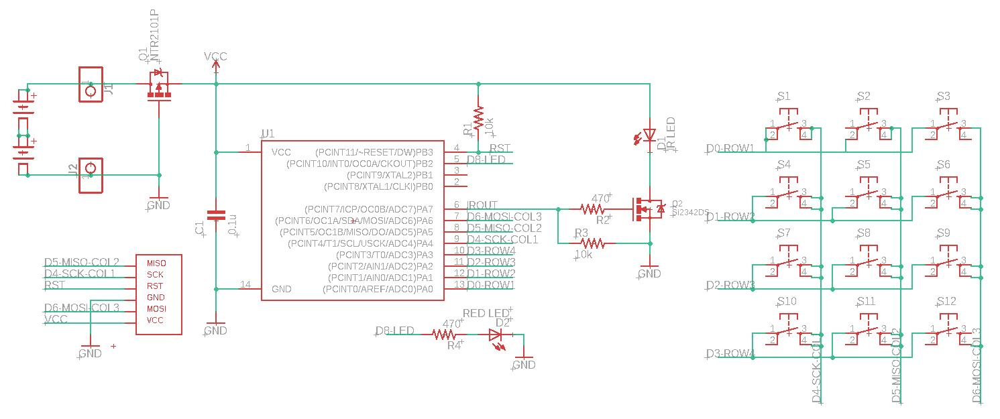
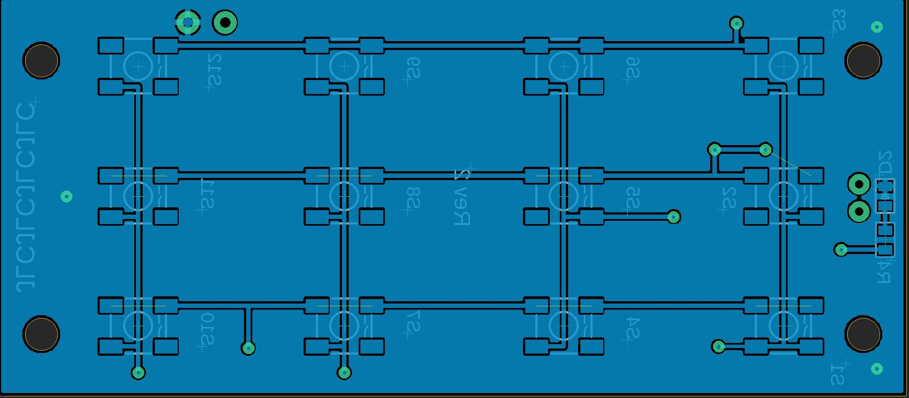
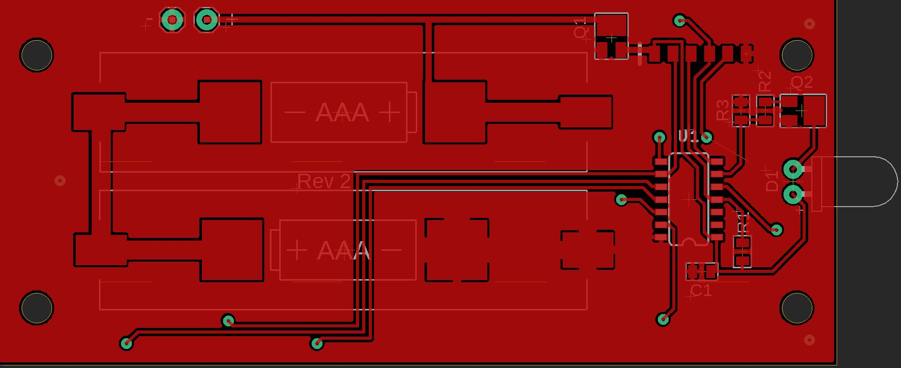
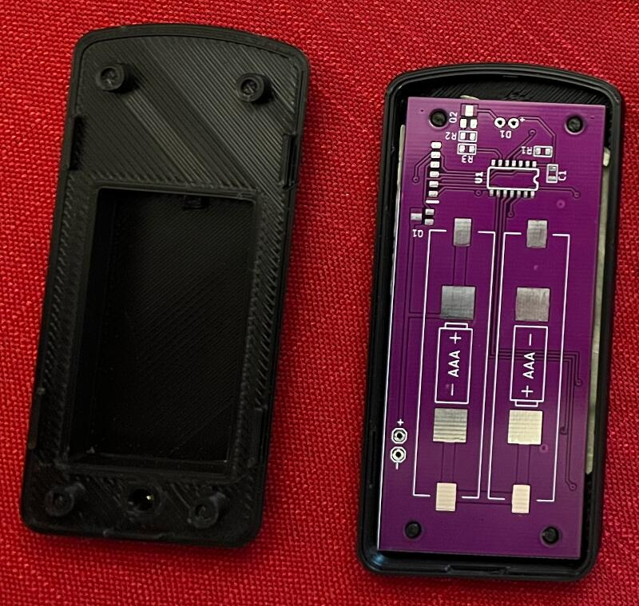
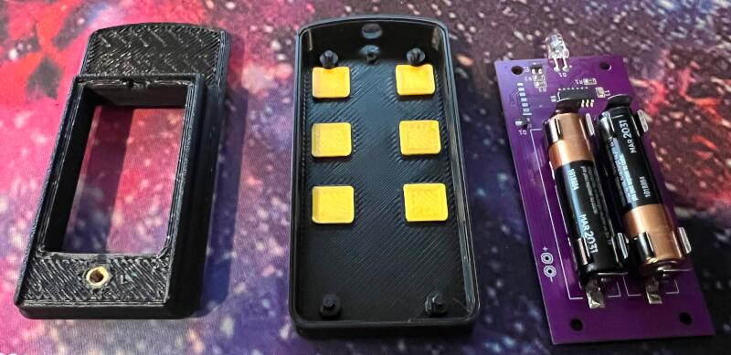
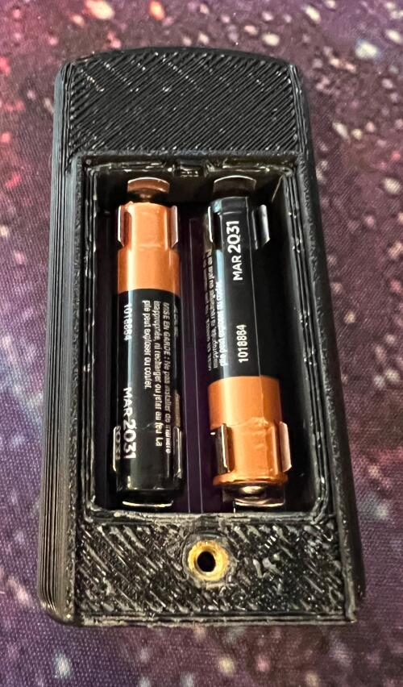
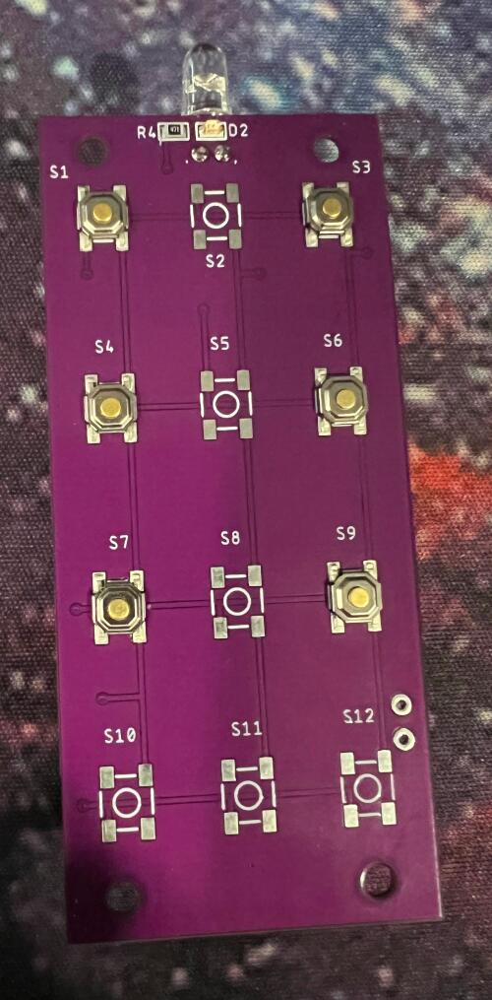
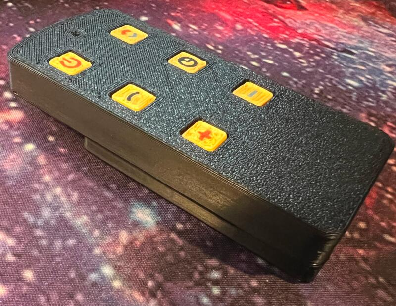
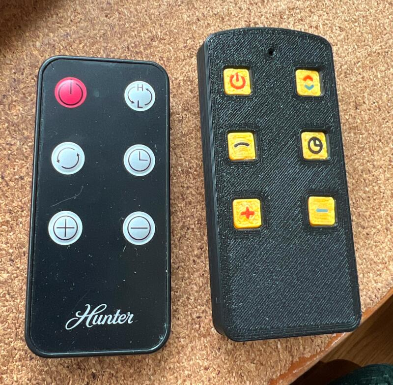
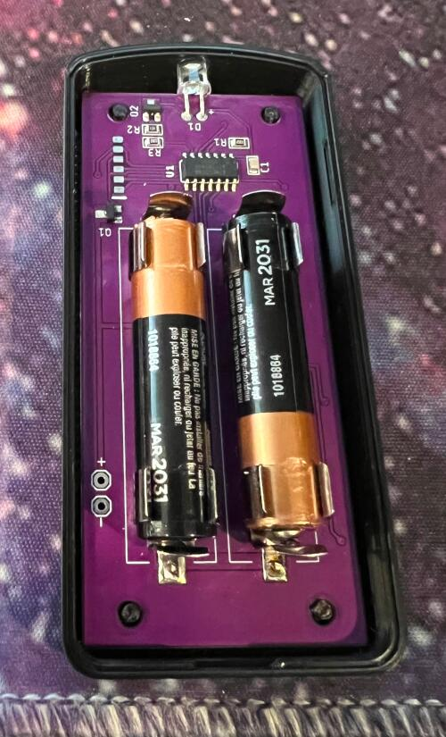

I have a *Hunter* space heater whose remote control had partially stopped working. The power and mode buttons no longer functioned. Rather than buying a new heater, I decided to take a crack at making a new remote control for it.

***

Some of the buttons still worked, so I setup a [simple IR receiver](https://github.com/Arduino-IRremote/Arduino-IRremote/blob/master/examples/ReceiveDemo/ReceiveDemo.ino) with an Arduino Nano to scan the working button codes. 

The design uses the ATTINY85 MCU and a matrix keypad with 12 buttons (although only 6 are in use for this).  Each button press fires an interrupt to wake the MCU and send the IR signal associated with the button. Once that completes, the MCU goes back into deep sleep. The circuit uses around 30mA while sending and <10nA when sleeping. Assuming 10 button presses per day (over only the winter months), the 2 AAA batteries *should* last more than [5 years](http://oregonembedded.com/batterycalc.htm).  I use NiMH rechargeable batteries removed at the end of each season, so if I have to recharge them once a year I'm happy.

Since I rarely order single PCBs, I designed it with 12 buttons to allow the PCBs to be used in future projects.

The battery clips are Keystone Electronics [55TR](https://www.keyelco.com/product.cfm/product_id/3970), available from [Mouser electronics](https://www.mouser.com/ProductDetail/534-55TR).

The Arduino sketch requires the following libraries:

- [IRremote](https://github.com/Arduino-IRremote/Arduino-IRremote/)
- [Keypad](https://github.com/Chris--A/Keypad)
- [PinChangeInterrupt](https://github.com/NicoHood/PinChangeInterrupt)

The pogo pin adapter is available here:

[https://github.com/timtilities/Pogo-Pin-ICSP-Adapter](https://github.com/timtilities/Pogo-Pin-ICSP-Adapter)

The Case has been designed to be 3D printed, including multicolored buttons. I used the [Z-hop multi-colored printing method](https://www.youtube.com/watch?v=0Sla-vIsvh4) to print the buttons in multiple colors. The top and bottom snap together around the electronics, and the battery cover uses a tab/screw combination to secure it into place. The M3 knurled heat-set insert can be purchased [from Amazon](https://www.amazon.com/dp/B0BW1YP5VQ?psc=1&ref=ppx_yo2ov_dt_b_product_details).

There is an alternative bottom design without the battery cover. It simply snaps together with the top.

Some additional pics at various points in the design and assembly stages:

